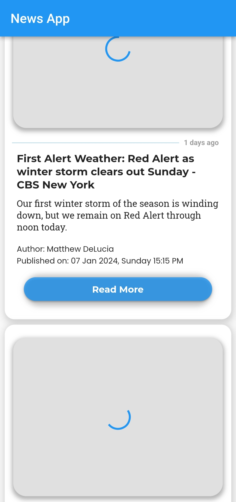

# News Explorer

## Table of Contents
- [Introduction](#introduction)
- [Project Overview](#project-overview)
- [Features](#features)
- [Screenshots](#screenshots)
- [Getting Started](#getting-started)
  - [Prerequisites](#prerequisites)
  - [Installation](#installation)
- [Usage](#usage)
- [Technologies Used](#technologies-used)
- [Dependencies](#dependencies)
- [Acknowledgements](#acknowledgements)

## Introduction

Welcome to News Explorer! This project is a news reading app developed using Flutter and powered by the NewsAPI. The primary goal of this project was to create an interactive and user-friendly mobile application where users can read the latest news.

## Project Overview

### Why I Started

The motivation behind News Explorer was to create a real-world Flutter application for my potential internship. I wanted to showcase my skills in mobile app development, UI/UX design, and integration with REST APIs.

### Challenges and Difficulties

During the development of News Explorer, I faced challenges such as:

- Handling asynchronous operations and state management in Flutter.
- Implementing a clean and attractive UI design.
- Integrating with a REST API (NewsAPI) and processing JSON responses.

Despite these challenges, I overcame them through research, online tutorials, and leveraging the Flutter community for guidance.

### Efforts and Contributions

News Explorer was developed as an individual project, showcasing my dedication to learning and implementing new technologies. I spent considerable time refining the user interface, optimizing code, and ensuring a smooth user experience.

## Features

- View the latest news headlines.
- Read detailed articles with images.
- Like articles to save them for later.
- Leave comments on articles.

## Screenshots

## Getting Started

### Prerequisites

Make sure you have the following installed:

- Flutter SDK
- Dart SDK
- Emulator or physical device for testing

### Installation

1. Clone the repository: `git clone https://github.com/yourusername/news-explorer.git`
2. Navigate to the project directory: `cd news-explorer`
3. Install dependencies: `flutter pub get`

## Usage

1. Run the app on an emulator or physical device: `flutter run`
2. Explore the latest news, like articles, and leave comments.

## Technologies Used

- Flutter
- Dart
- NewsAPI

## Dependencies

- intl
- http
- google_fonts
- url_launcher
- cupertino_icons
- connectivity
- cached_network_image

## Acknowledgements

- The Flutter and Dart communities for valuable resources and support.
- NewsAPI for providing a powerful and easy-to-use news database.
- Online tutorials and documentation that contributed to the project's development.

---
